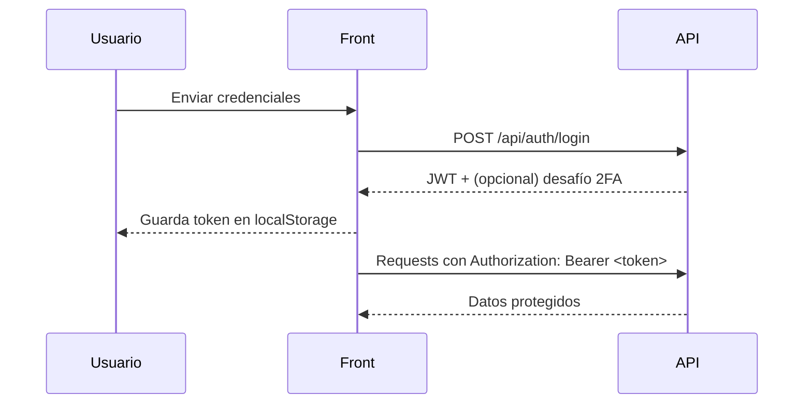

# Documentación del proyecto Donación de Sangre

## 1. ¿Qué hay acá?
Este repo tiene dos piezas: un backend Express que expone la API y un frontend estático (Vite) que consume esa API. El objetivo es ayudar a gestionar donantes, campañas y acceso seguro (login + 2FA opcional).

```
raíz
├─ back/        # API Express + PostgreSQL
├─ front/       # Sitio estático (Vite) y assets
└─ docs/        # Documentación
```

## 2. Stack rápido
- Backend: Node 20+, Express 5, JWT, PostgreSQL, nodemailer, cron para workers.
- Frontend: Vite, JS vanilla (módulos ES), HTML/CSS.
- Infra: Railway (dev y prod). Front puede servirse desde Hostinger o Railway estático.

## 3. Arquitectura (vista corta)
```mermaid
graph TD
  A[Frontend (Vite/Hostinger)] -->|fetch /api| B[API Express - Railway]
  B --> C[(PostgreSQL - Railway)]
  B --> D[SMTP Hostinger]
  B --> E[Workers cron]
  A -->|JWT en headers| B
```

Autenticación (flujo típico):


## 4. Entornos y URLs
- Dev local: API `http://localhost:3000`; front vía `npm run dev` (Vite) o sirviendo `index.html`.
- Staging (Railway dev): `https://donaciones-back-dev-entorno.up.railway.app`
- Producción (Railway): `https://donaciones-production.up.railway.app`

El frontend decide entorno en `front/src/utils/config.js`:
- Si hostname es localhost/127 → `development`.
- Podés forzar con query `?env=staging|production` o en `localStorage` la clave `DONACIONES_ENV`.

## 5. Variables de entorno clave
Backend (Railway):
- `DATABASE_URL` (PostgreSQL)
- `JWT_SECRET`
- SMTP: `EMAIL_HOST`, `EMAIL_PORT`, `EMAIL_USER`, `EMAIL_PASS`, `EMAIL_FROM`
- `CORS_ORIGINS` → lista separada por comas. Ej.: `https://donaciones.roprogrammer.online,https://donaciones-production.up.railway.app,http://127.0.0.1:5500`

Frontend:
- Sin .env; usa `config.js`. Si necesitás puntear API distinta, ocupá `?env=` o `localStorage`.

## 6. Comandos útiles
Backend:
- `npm install`
- `npm run dev` (nodemon)
- `npm start`

Frontend:
- `npm install`
- `npm run dev`
- `npm run build` (genera `front/dist`)

## 7. Endpoints principales (resumen)
- Auth: `POST /api/auth/register`, `POST /api/auth/login`, `POST /api/auth/verify-2fa`, `POST /recover-password`, `POST /reset-password`, `GET /validate`.
- Donantes: `GET /api/donantes` (admin/centro), `GET /api/donantes/filtro`, `GET /api/donantes/me` (donante), `GET/PUT /api/donantes/perfil`, `POST /api/donantes` (alta), `DELETE /api/donantes/baja`, campañas del donante `/campanias` y asistencia `/campanias/:id/asistir`.
- Catálogos: provincias `/api/provincias`, localidades `/api/localidades`, barrios `/api/barrios`.
- Admin/centro: ver rutas en `back/src/routes/admin.routes.js` y `centro.routes.js`.

Todas las rutas protegidas usan `Authorization: Bearer <token>` y, según el caso, `roleMiddleware` valida el rol (`admin`, `centro`, `donante`).

## 8. Frontend: estructura y notas
- Home: `front/index.html` + `src/index.js`
- Auth: `src/auth/login.html|verify.html` + `auth.js`, `sessionManager.js` (gestiona fetch con headers y manejo de token), `tokenValidator.js`.
- Donante: vistas en `src/donante/` (registro, perfil, campañas).
- Estilos base: `src/styles.css`, más hojas por módulo (`auth/auth.css`, etc.).
- Logs: `src/utils/logger.js` (consola).

## 9. Despliegue resumido
Backend (Railway):
1. `railway link` al servicio backend.
2. `railway environment use production` (o staging).
3. Cargar variables (ver sección 5).
4. `railway deploy` (o `railway up`).

Frontend:
- Railway estático: `railway link` al servicio front, `railway environment use production`, `npm run build`, `railway deploy`.
- Hostinger: subir `front/dist` (o la carpeta `front` si servís estático) y apuntar `config.js` por hostname (ya automático si usás el dominio).

## 10. Troubleshooting rápido
- CORS con credenciales: asegurate de no usar `Access-Control-Allow-Origin: *` cuando `credentials: "include"`. Seteá `CORS_ORIGINS` y redeploy.
- Token inválido: `localStorage` puede tener `DONACIONES_ENV` forzado; limpialo si ves entorno incorrecto.
- 404 favicon: subí un `favicon.ico` al hosting, opcional.

## 11. Cómo colaborar
- Rama `dev` para cambios; merge a `produccion` para releases.
- No subir secretos a git. En docs usamos solo nombres de variables, no valores.
- Revisá CORS y URLs después de cada deploy.

## 12. Próximas mejoras sugeridas
- Agregar tests automáticos (API y flujos front básicos).
- Scripts de verificación de entorno (health y smoke).
- Documentar contratos de payloads más finos (schemas por ruta).

Hablemos en tono humano: cualquier ajuste o sección extra que necesites (más diagramas, pasos detallados de campañas, o un PDF), avisá y lo sumamos.
